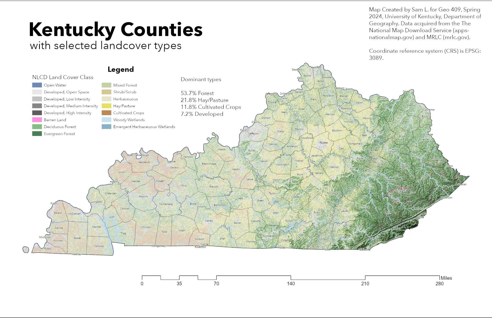

# geo409-field-trip-maps

2 maps to use on a field exercise

 
Kentucky counties with selected land cover types- [Download GeoPDF](Ky-Landuse.pdf) 

    
UKy central campus canopy model- [Download GeoPDF](Real-Canopy-Height-Model.pdf)   

Maps created by Sam L. for GEO409, Spring 2024, University of Kentucky Department of Geography

https://sgla226.github.io/geo409-field-trip-maps/
